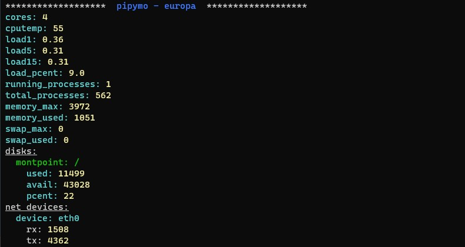

# PiPyMon

Raspberry pi* lightweight monitoring tool in python

pipymo is a cli monitoring tool writen in python it uses flask to serve as a prometheus exporter and a json api if you want to. 

pipymo wraps a bunch of shell commands and parses it to monitor:

> you can disable or customize some options in your config file -> /home/YOUR_USERNAME/.pipymo/config.yaml

- CPU usage
- CPU temperature
- RAM and swap usage
- running processes / total processes
- System load average (1, 5, 15) min 
- Disk usage
- measure network traffic 

Besides the monitoring part i added some other small but usefull ( at least for me ) commands like getting the public ip of your network and ping some defined hosts for connectivity check.



# Usage

pipymo echo -> to output the current status to console
pipymo serve -> to start http server will serve /json and /metrics endpoints with the same information that you get on "echo" command

pipymo ping -> to ping your hosts defined in your config folder -> /home/YOUR_USERNAME/.pipymo/ping_hosts.txt
pipymo myip -> to get your public IP. This makes a request to https://api.ipify.org presenting you with the result


## How to use it 

```shell
git clone git@github.com:dirop1/pipymo.git && cd pipymo 
pip install -r requirements.txt
python3 . echo
```

## Instalation and auto start up

In the working directory:

```shell
chmod +x ./install.sh && ./install.sh
```

> you will be prompted to input sudo password so we can write to the services path


the pipymo service will be installed by now
you can now run commands like:

```shell
pipymo myip
```

if you want enable the http server at start up just enable the service service with:

```shell
sudo systemctl enable pipymo && sudo systemctl start pipymo
```


>The configuration used is now in '~/.pipymo/config.yaml' you can edit it and restart the service

# executing shell comands over http

In the config file you can now enable the execution of commands in your system.

For that you need to:
- define it in `config.yaml` (check the example config file) 
- restart pipymo
- do an http get for http://[yourip]:[yourport]/exec-cmd/NAME_OF_COMAND 

# Customization

In the config folder of this repo there is 2 files that you should place in ~/.pipymo/ (if you used the install script they will be there by now) 

Just edit the files to suite your needs.

- The config.yaml is a configuration file that specify to pipymo what to monitor and the http port to use when using the http server (read the comments in the configuration file to get more info)
- The ping_hosts.txt is just a line-separated list of hosts that will be ping'd when you run the "pipymo ping" command

> * it should work too in debian based distros

## Unninstalling

```shell
chmod +x ./uninstall.sh && ./uninstall.sh
```

Please delete manually the pipymo folder and the configuration on ~/.pipymo/*


# Output

Showing in json but the prometheus is similar just in prom format

```json
{
  "cores": 4, 
  "cputemp": 56,
  "load1": 1.35,
  "load5": 1.52,
  "load15": 1.47,
  "load_pcent": 33.75,
  "running_processes": 1,
  "total_processes": 1325,
  "memory_max": 3973,
  "memory_used": 3283,
  "swap_max": 2147,
  "swap_used": 458,
  "rxtx": [ // total received and transmited in KB
    {
      "device": "eth0",
      "rx": 224485,
      "tx": 42935
    }
  ],
  "rxtx_s": [ // only available on server mode not in cli
    {
      "device": "eth0", // total received and transmited in KB per second since last call
      "rx_s": 135,
      "tx_s": 11
    }
  ],
  "disks": [
    { // stats in MB
      "mountpoint": "/",
      "used": 42795, 
      "avail": 187430,
      "pcent": 19
    }
  ]
}
```


## Grafana 


> The id of the dashboard is 18959

[Get it at grafana.com](https://grafana.com/grafana/dashboards/?search=pipymo)
